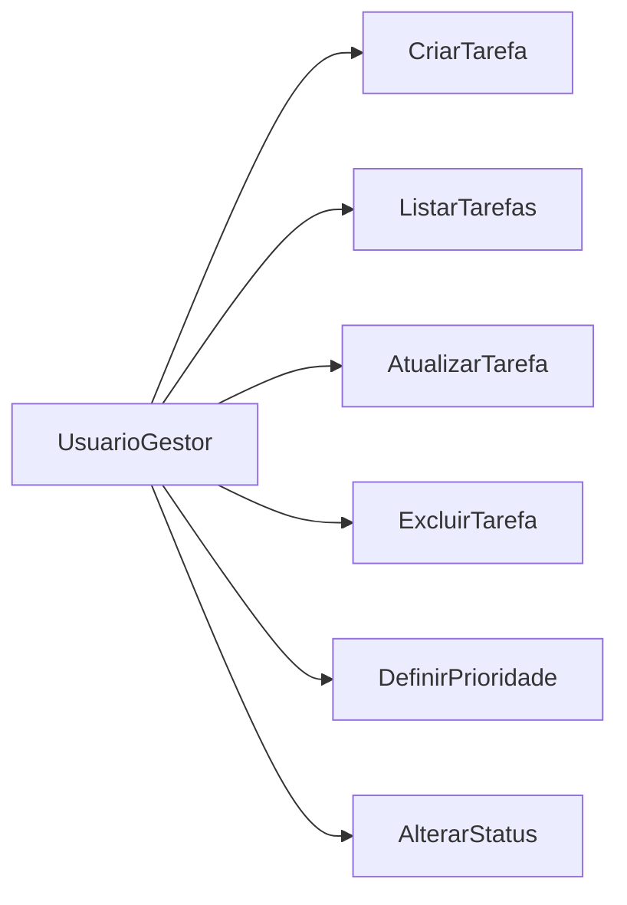
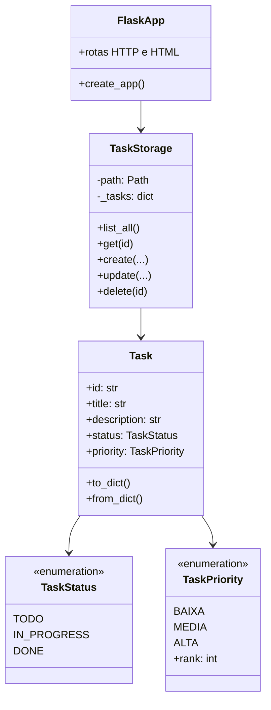

# Parte Teórica — TechFlow Task Manager

**Disciplina:** Engenharia de Software  
**Projeto:** Construindo um Projeto Ágil no GitHub  
**Repositório:** https://github.com/DevDaniloOliveira/TrabalhoTechFlow  

> Este arquivo é o rascunho completo da entrega teórica. Exporte para PDF/DOCX e substitua a seção de prints pelos capturas reais do seu GitHub.

---

## 1. Descrição do projeto e escopo inicial

A **TechFlow Solutions** foi contratada por uma startup de logística para desenvolver um sistema de gerenciamento de tarefas alinhado a práticas ágeis. O objetivo é permitir que a equipe operacional acompanhe o fluxo de trabalho, registre atividades e atualize status de forma simples e rastreável.

**Escopo inicial:**

- CRUD de tarefas (criar, listar, editar, excluir)
- Status: a fazer, em progresso, concluído
- Interface web básica
- Testes automatizados (Pytest)
- Integração contínua (GitHub Actions)

**Exemplo de mercado:** ferramentas como **Trello**, **Jira** e **Asana** já oferecem quadros Kanban e gestão de tarefas. O TechFlow não compete com esses produtos; é um protótipo acadêmico que demonstra o ciclo de vida de software (requisitos → modelagem → implementação → testes → CI → mudança de escopo) usando o GitHub como hub de colaboração.

---

## 2. Metodologia ágil utilizada

Foi adotado um híbrido **Scrum + Kanban**:

| Prática | Como foi aplicada |
|---------|-------------------|
| Kanban | GitHub Projects com colunas A Fazer / Em Progresso / Concluído |
| Issues | Cada funcionalidade virou um card (issues #1 a #11) |
| Branches/PR | Uma branch `feature/TF-XX` e um Pull Request por tarefa |
| Commits semânticos | Mensagens em português descrevendo o “porquê” da mudança |
| CI | GitHub Actions executando flake8 + Pytest a cada PR |

Essa combinação reduz falhas comuns em projetos ágeis (má gestão de tarefas e falta de visibilidade), porque o quadro e o histórico de PRs tornam o progresso explícito.

---

## 3. Importância da modelagem na Engenharia de Software

A modelagem (especialmente UML) ajuda a:

1. **Alinhar stakeholders** — o diagrama de casos de uso mostra *o que* o sistema faz, sem detalhe de código.
2. **Orientar a implementação** — o diagrama de classes antecipa entidades, atributos e responsabilidades.
3. **Absorver mudanças** — quando o cliente pediu prioridade, bastou estender o modelo `Task` em vez de redesenhar tudo.

Sem modelagem, mudanças de escopo tendem a gerar retrabalho e inconsistências entre documentação e código.

---

## 4. Diagrama de Casos de Uso

Atores: **Usuário/Gestor operacional**.

**Descrição breve:**

- **Criar tarefa:** registra título, descrição, status e (após mudança de escopo) prioridade.
- **Listar tarefas:** visualiza o backlog ordenado por prioridade.
- **Atualizar / Excluir:** mantém o quadro operacional atualizado.
- **Definir prioridade / Alterar status:** suportam o fluxo Kanban da operação logística.

> No PDF final, substitua o Mermaid por imagem exportada do draw.io / Lucidchart se a instituição exigir UML clássico.

---

## 5. Diagrama de Classes

---

## 6. Justificativa da mudança de escopo

O cliente solicitou **priorizar tarefas críticas** (atrasos, falhas em docas, pedidos com SLA curto). O status sozinho não distinguia urgência.

**Impacto no projeto:**

- Novo atributo `priority` no modelo
- Ajuste na UI e na API
- Novos testes (`test_priority.py`)
- Atualização do README e do Kanban (issue #11)

A mudança foi tratada como incremento ágil: card no quadro → branch/PR → CI → merge, sem interromper o restante do backlog já entregue.

---

## 7. Testes automatizados

Ferramenta: **Pytest**.

Cobertura principal:

| Área | Exemplos |
|------|----------|
| CRUD | criar, listar, atualizar status, excluir |
| Validação | título vazio → 400 / ValueError |
| Prioridade | criar com alta, rejeitar valor inválido, ordenação |

O pipeline **GitHub Actions** (`.github/workflows/ci.yml`) executa **flake8** (qualidade) e **Pytest** em todo push/PR, reduzindo regressões e dando evidência objetiva de qualidade.

---

## 8. Prints comentados do GitHub

*(Cole aqui os prints e mantenha as legendas.)*

### 8.1 Kanban com tarefas
**Print:** aba Projects com ≥ 10 cards nas colunas A Fazer / Em Progresso / Concluído.  
**Comentário:** o quadro materializa o fluxo ágil; cards concluídos correspondem a PRs mergeados (TF-01 … TF-11).

### 8.2 Commits relevantes
**Print:** histórico de commits / lista de PRs.  
**Comentário:** commits semânticos em português (`feat:`, `test:`, `ci:`, `docs:`) documentam a evolução incremental.

### 8.3 Workflow de CI funcionando
**Print:** Actions com check verde (job “Testes e qualidade”).  
**Comentário:** a CI valida flake8 + Pytest automaticamente a cada integração, sustentando entregas confiáveis.

---

## 9. Link do vídeo pitch

- YouTube/Drive: *(colar link público)*

---

## Referências

- GitHub Docs — Actions  
- Pressman — Engenharia de Software (metodologias ágeis)  
- Atlassian — Kanban no GitHub / produtividade  
