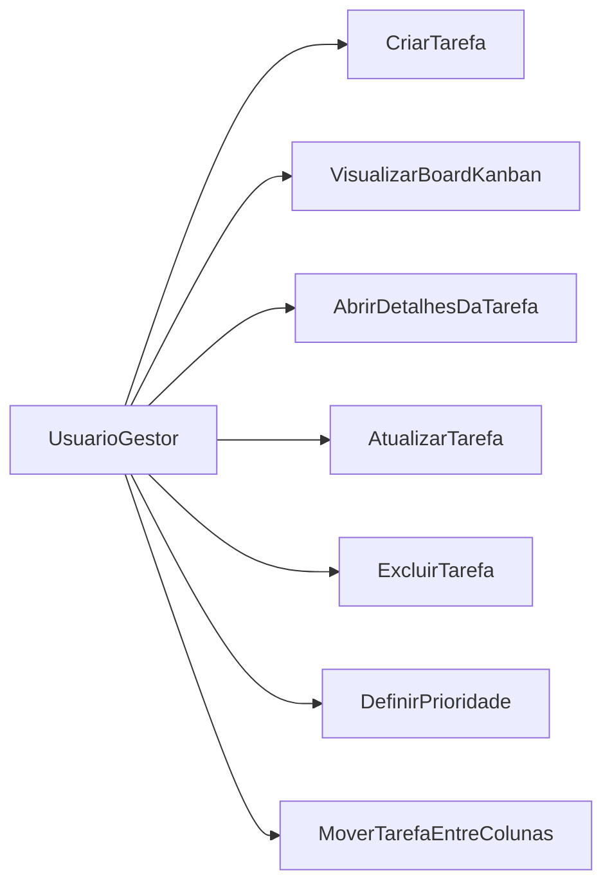
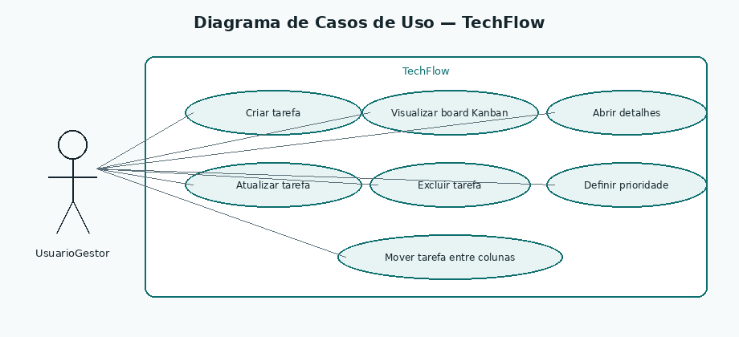
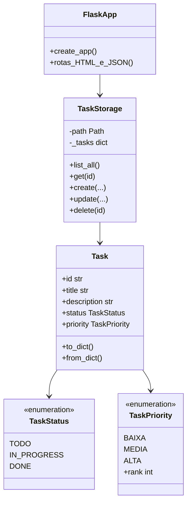
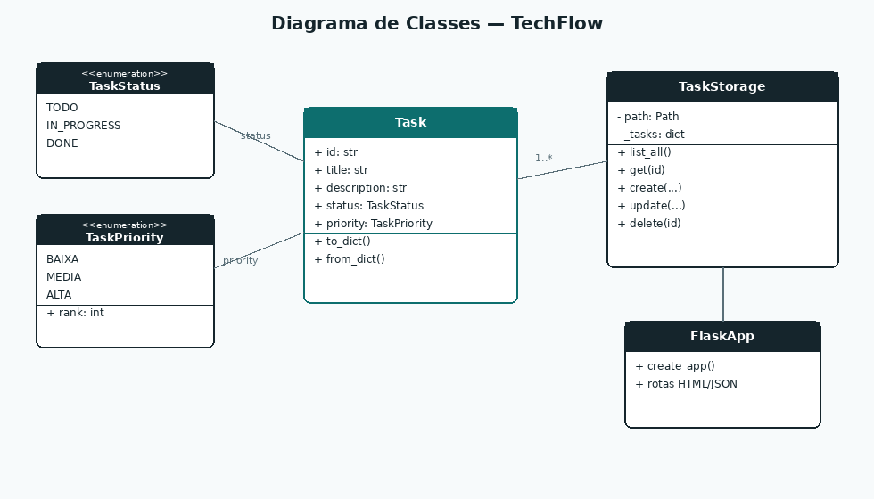
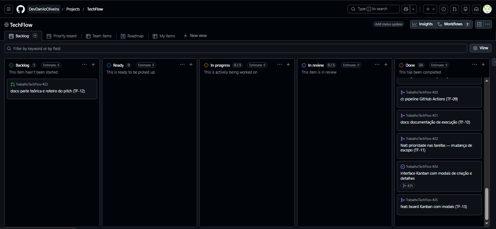
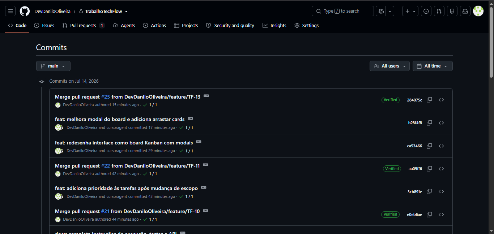
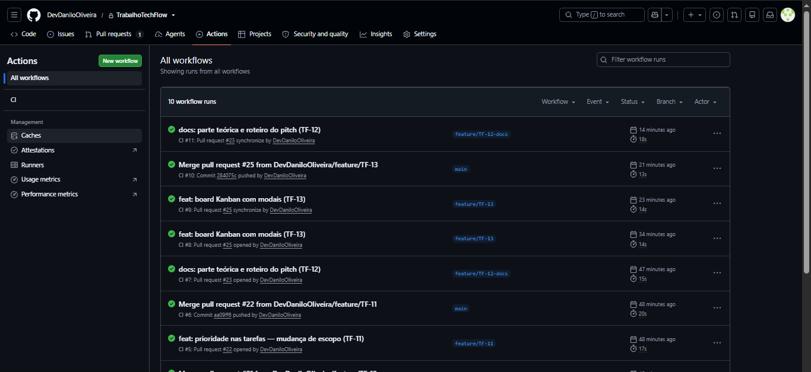
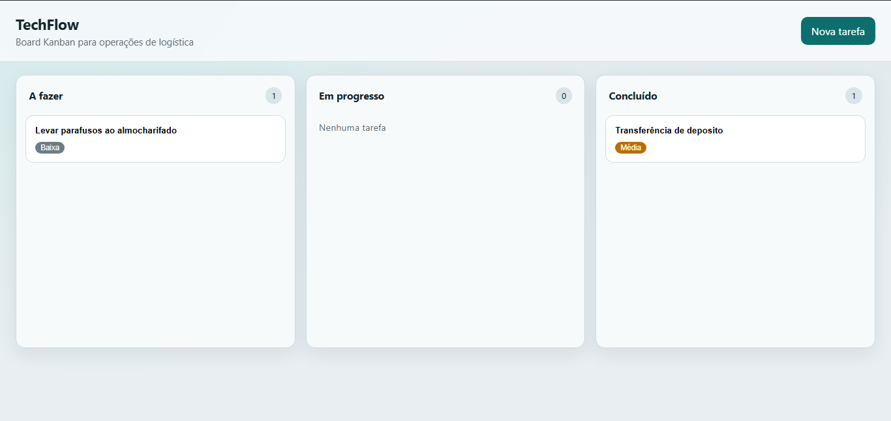

# Parte Teórica — TechFlow Task Manager

**Disciplina:** Engenharia de Software  
**Trabalho:** Construindo um Projeto Ágil no GitHub — Da Gestão ao Controle de Qualidade  
**Empresa fictícia:** TechFlow Solutions  
**Cliente:** startup de logística  
**Repositório:** [https://github.com/DevDaniloOliveira/TrabalhoTechFlow](https://github.com/DevDaniloOliveira/TrabalhoTechFlow)  
**Autor:** Danilo Oliveira de Almeida  
**Data:** 14/07/2026

> Documento de entrega da Parte Teórica.  
> As prints obrigatórias já estão em `docs/prints/` e referenciadas na seção 8.

---

## 1. Descrição do projeto e escopo inicial

A **TechFlow Solutions** foi contratada para desenvolver um sistema de gerenciamento de tarefas baseado em metodologias ágeis. O cliente, uma startup de logística, precisa acompanhar o fluxo de trabalho, priorizar tarefas críticas e manter visibilidade do status das operações (separação, coleta, atrasos, etc.).

### Escopo inicial

- CRUD de tarefas (criar, listar, editar, excluir)
- Status alinhados ao fluxo Kanban: **a fazer**, **em progresso**, **concluído**
- Interface web básica
- Testes automatizados com **Pytest**
- Pipeline de CI com **GitHub Actions** (testes + qualidade de código)
- Organização do trabalho no **GitHub Projects** (issues + PRs)

### Solução desenvolvida (visão atual)

Sistema web em **Python/Flask** com:

- Board Kanban na própria aplicação (colunas por status)
- Cards resumidos; detalhes, edição e exclusão em modal
- Criação de tarefas via modal “Nova tarefa”
- Arrastar cards entre colunas para alterar status
- Campo de **prioridade** (baixa / média / alta) — introduzido como mudança de escopo

### Exemplo de mercado

Ferramentas como **Trello**, **Jira** e **Asana** já oferecem quadros Kanban e gestão de tarefas. O TechFlow não pretende substituí-las: é um protótipo acadêmico que demonstra o ciclo de vida de software (requisitos → modelagem → implementação → testes → CI → adaptação de escopo) usando o GitHub como hub de colaboração.

---

## 2. Metodologia ágil utilizada

Foi adotado um híbrido **Scrum + Kanban**:

| Prática                  | Aplicação no projeto                                                           |
| ------------------------ | ------------------------------------------------------------------------------ |
| Kanban (GitHub Projects) | Colunas de fluxo (Backlog / In progress / Done, etc.) com **mais de 10 cards** |
| Issues                   | Cada funcionalidade virou uma issue rastreável                                 |
| Branches e PRs           | Branch `feature/TF-XX` + Pull Request por entrega                              |
| Commits semânticos       | Mensagens em português (`feat:`, `test:`, `ci:`, `docs:`)                      |
| Integração contínua      | Actions executando **flake8** + **Pytest** em push/PR                          |
| Incrementos              | Entregas pequenas e frequentes, com board sempre refletindo o status           |

Essa abordagem mitiga falhas comuns em projetos ágeis — má gestão de tarefas e falhas de comunicação — porque o quadro, os PRs e o CI tornam o progresso e a qualidade **visíveis**.

**Principais beneficiados:** gestores/operações (visão do fluxo), desenvolvedores (backlog claro + CI) e o cliente de logística (priorização de tarefas críticas).

---

## 3. Importância da modelagem na Engenharia de Software

A modelagem (em especial UML) é importante porque:

1. **Alinha expectativas** — casos de uso mostram *o que* o sistema faz, sem detalhe de código.
2. **Guia a implementação** — o diagrama de classes antecipa entidades, atributos e responsabilidades.
3. **Facilita mudanças** — quando o cliente pediu prioridade, o modelo `Task` foi estendido de forma controlada.
4. **Documenta decisões** — serve de evidência no ciclo de vida e na comunicação com stakeholders.

Sem modelagem, mudanças de escopo tendem a gerar retrabalho e inconsistência entre documentação e código.

---

## 4. Diagrama de Casos de Uso (UML)

**Ator:** Usuário / Gestor operacional.

| Caso de uso         | Descrição                                               |
| ------------------- | ------------------------------------------------------- |
| Criar tarefa        | Registra título, descrição, status e prioridade (modal) |
| Visualizar board    | Consulta tarefas agrupadas por status                   |
| Abrir detalhes      | Visualiza informações completas no modal                |
| Atualizar / Excluir | Mantém o quadro operacional atualizado                  |
| Definir prioridade  | Destaca tarefas críticas da operação                    |
| Mover entre colunas | Altera status por drag-and-drop no board                |

> **Para o PDF:** o diagrama Mermaid acima já documenta os casos de uso. A imagem exportada correspondente está abaixo.

---

## 5. Diagrama de Classes (UML)

---

## 6. Justificativa da mudança de escopo

Durante o desenvolvimento, o cliente solicitou **priorizar tarefas críticas** (atrasos de entrega, falhas em docas, pedidos com SLA curto). O CRUD com status sozinho não distinguia urgência: itens críticos competiam visualmente com tarefas rotineiras.

### Como a mudança foi gerenciada (prática ágil)

1. **Card no Kanban** — issue de mudança de escopo (prioridade)
2. **Implementação** — campo `priority` (`baixa` / `media` / `alta`), UI, ordenação e drag-and-drop mantendo o fluxo
3. **Testes** — `tests/test_priority.py`
4. **Documentação** — seção “Mudança de escopo” no `README.md`
5. **PR + CI** — validação automática antes do merge

Isso demonstra adaptabilidade: o escopo mudou sem descartar o que já estava entregue.

---

## 7. Testes automatizados e controle de qualidade

### Pytest

Ferramenta: **Pytest**. Principais coberturas:

| Área       | O que valida                                |
| ---------- | ------------------------------------------- |
| CRUD       | Criar, listar, atualizar status, excluir    |
| Validação  | Título vazio → erro                         |
| Prioridade | Criação, valor inválido, ordenação no board |
| Interface  | Renderização das colunas do Kanban web      |

### GitHub Actions

Arquivo: `.github/workflows/ci.yml`

Em cada `push`/`pull_request` o pipeline:

1. Configura Python 3.12
2. Instala dependências
3. Roda **flake8** (qualidade de código)
4. Roda **Pytest**

Isso reduz regressões e evidencia entrega confiável — alinhado à questão norteadora sobre controle de qualidade e CI.

---

## 8. Prints comentados do GitHub

As capturas abaixo evidenciam a gestão ágil, o histórico de evolução e o pipeline de qualidade no repositório público.

### 8.1 Kanban com tarefas (GitHub Projects)

**Figura 1 — Quadro Kanban no GitHub Projects.**  
O board **TechFlow** organiza o fluxo com colunas (Backlog, Ready, In progress, In review, Done). Há **mais de 10 cards** (24 em Done no momento da captura), cobrindo desde o setup do repositório até CI, mudança de escopo (prioridade) e a interface Kanban da aplicação. O card restante no Backlog (#23) corresponde à documentação teórica em andamento. Isso materializa a gestão ágil e reduz falhas de comunicação/visibilidade.

---

### 8.2 Commits relevantes

**Figura 2 — Histórico de commits em** `main`**.**  
Os commits seguem mensagens semânticas em português (`feat:`, `docs:`, merges de PR). Destacam-se entregas incrementais como o board Kanban com modais (TF-13), o arraste de cards, a prioridade pós-mudança de escopo (TF-11) e a documentação de execução (TF-10). O volume supera o mínimo de 10 commits exigido e deixa rastreável cada evolução do sistema.

---

### 8.3 Workflow de CI funcionando

**Figura 3 — Aba Actions com workflow CI bem-sucedido.**  
Todos os runs recentes do workflow **CI** aparecem com status verde (sucesso), incluindo merges em `main` e PRs de feature (`TF-11`, `TF-12`, `TF-13`). O pipeline executa **flake8** (qualidade) e **Pytest** (testes), garantindo feedback automático a cada integração.

---

### 8.4 Sistema em execução (board da aplicação)

**Figura 4 — Interface web do TechFlow em execução.**  
A aplicação apresenta o board com colunas **A fazer / Em progresso / Concluído**, cards resumidos (título + prioridade) e o botão **Nova tarefa**. O exemplo mostra tarefas operacionais de logística com prioridades Baixa e Média, alinhado ao padrão de ferramentas de gestão de tarefas.

---

## 9. Link do vídeo pitch

- Plataforma: YouTube / Google Drive  
- Link público: `________________________________`

*(Após publicar, cole o link aqui e também no README do repositório, se desejar.)*

---

## 10. Referências

1. Documentação oficial do GitHub — Actions
2. Pressman, R. S. — *Engenharia de Software: Uma Abordagem Profissional* (metodologias ágeis)
3. Atlassian — materiais sobre Kanban e produtividade
4. Repositório do projeto: [https://github.com/DevDaniloOliveira/TrabalhoTechFlow](https://github.com/DevDaniloOliveira/TrabalhoTechFlow)

---

## Apêndice — Checklist de entrega

| Entregável                              | Status                               |
| --------------------------------------- | ------------------------------------ |
| PDF/DOCX teórico (seções 1–8)           | [ ] exportar a partir deste Markdown |
| Prints Kanban / Commits / Actions / App | [x] em `docs/prints/`                |
| Diagramas UML (casos de uso + classes)  | [ ] exportar Mermaid ou redesenhar   |
| Repo público com app + testes + CI      | [x]                                  |
| Mudança de escopo documentada           | [x]                                  |
| Vídeo ≤ 4 min com link público          | [ ]                                  |

